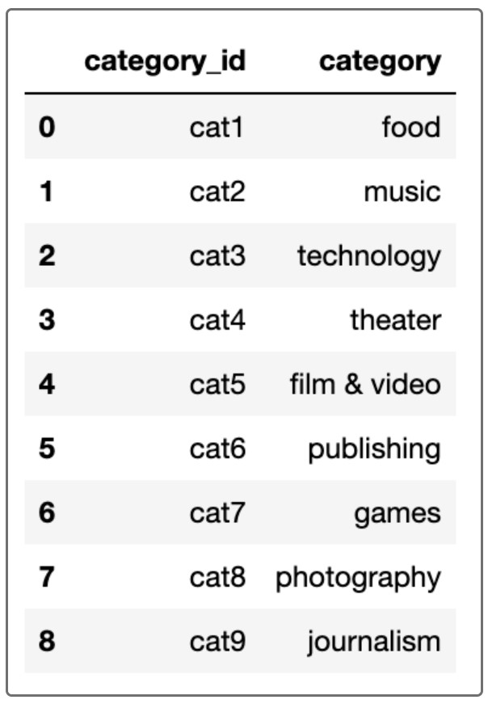
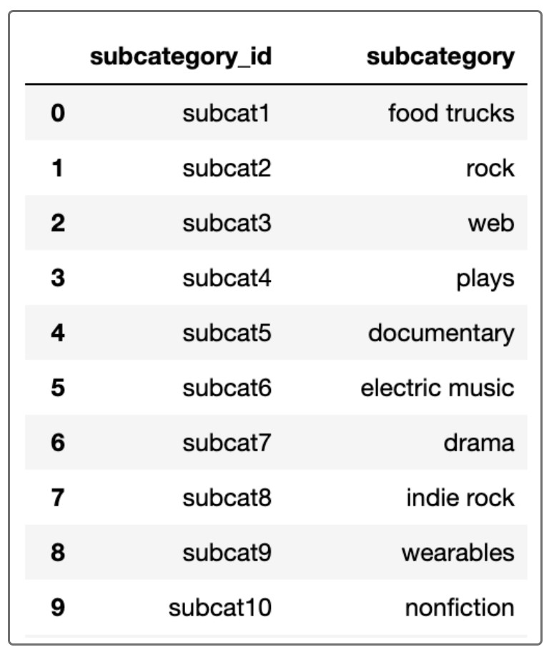
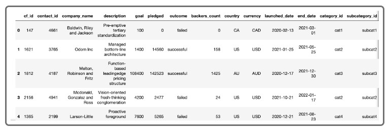
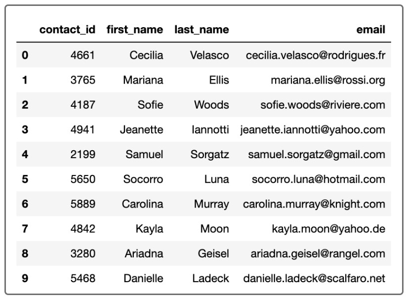

# Crowdfunding_ETL
This exercise use Python and Pandas to extract, transform, and clean excel datas into csv files, which then is used to create a database. 

### Background
For the ETL mini project, you will work with a partner to practice building an ETL pipeline using Python, Pandas, and either Python dictionary methods or regular expressions to extract and transform the data. After you transform the data, you'll create four CSV files and use the CSV file data to create an ERD and a table schema. Finally, you’ll upload the CSV file data into a Postgres database.

### Instructions
**Objective:**
Create a database to provide easy access to data records based on the interest of the questions. 
* Read excel datas as Pandas DataFrame
* Transform and clean data
* Save dataframes into csv files 
* Sketch an ERD using [Quick Database Diagrams](https://app.quickdatabasediagrams.com/#/) with the csv files
* Create a table schema saved as `crowdfunding_db_schema.sql` for each csv files based on the ERD
* Create database named `crowdfunding_db` with table schema and import csv files to appropriate tables

#### Results
1. Category DataFrames

2. Subcategory DataFrame 

3. Campaign DataFrame

4. Contacts DataFrame

5. ERD sketch 

#### Team Members
* Kameron Thao
* Mary Vang
* Nou Yang
* Zac Lau
